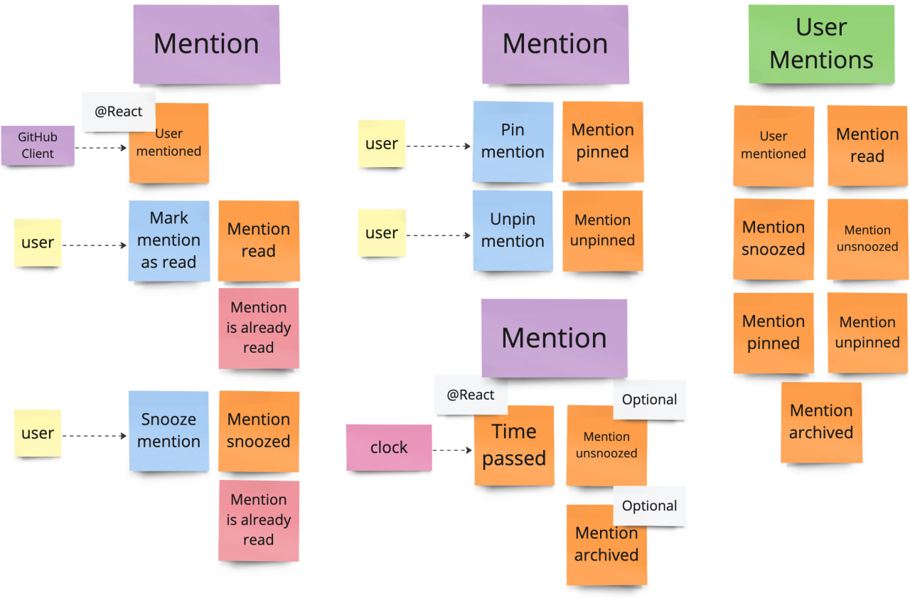

# #EventStorming

The [#EventStorming](https://www.eventstorming.com/) sessions resulted 
in the identification of two bounded contexts.

- **Sessions** manages user sessions and handles authentication via GitHub. 
  It is also responsible for automatically refreshing the session if it has expired.

- **Mentions** manages user mentions and retrieves new mentions from GitHub. 
  Additionally, it oversees mention states and is responsible for deactivating snooze mode.

