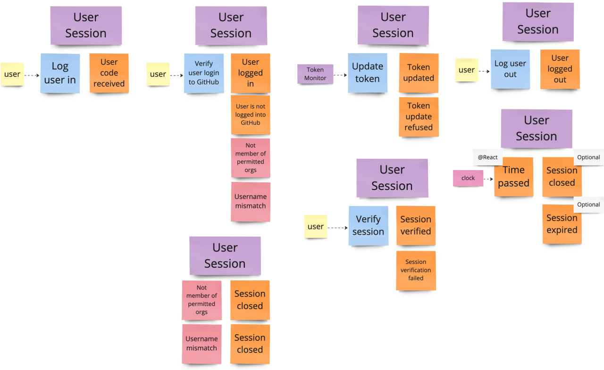
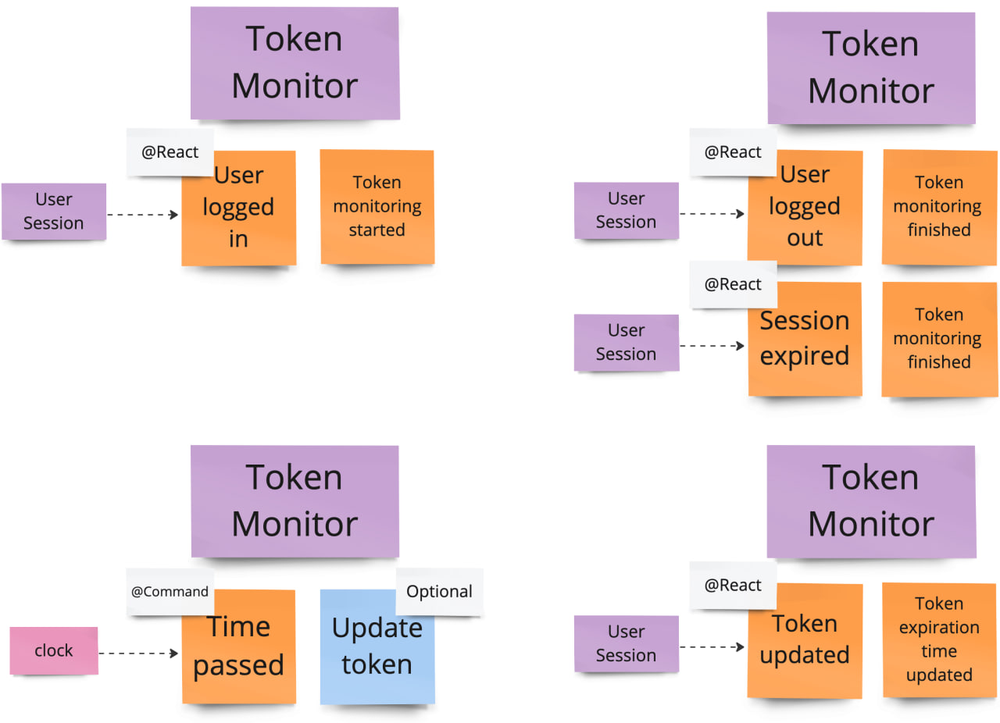

# #EventStorming

The [#EventStorming](https://www.eventstorming.com/) sessions resulted 
in the identification of two bounded contexts.

- **Sessions**, describing all interactions with end-users, 
  including their authentication via GitHub.

 

- **Mentions**, meticulously following all cases of someone mentioning end-users 
  of Pingh at GitHub.

 

