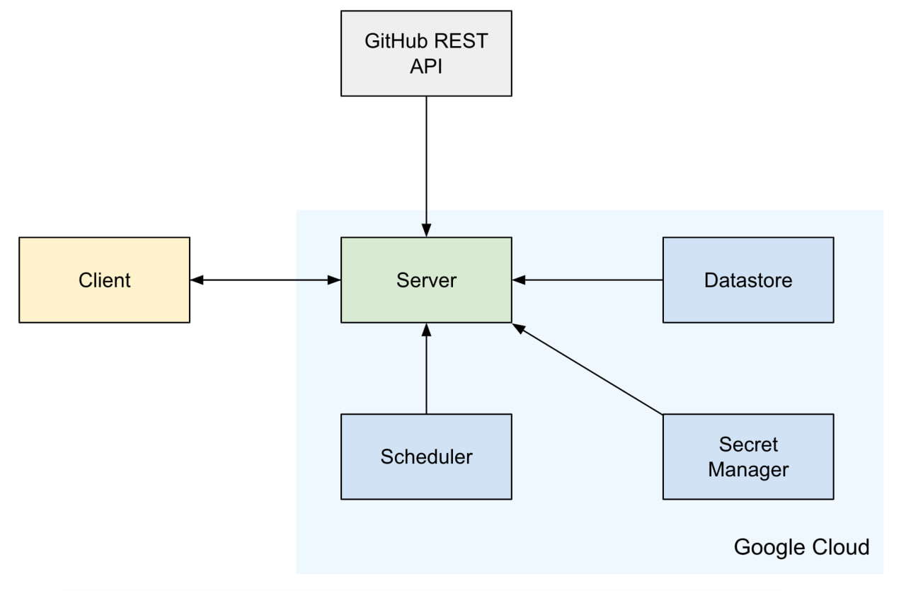
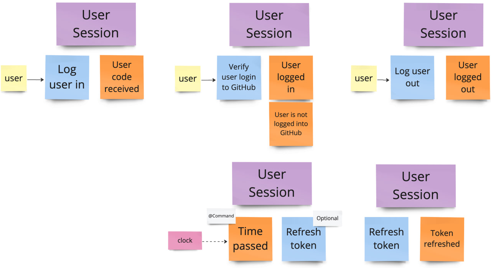
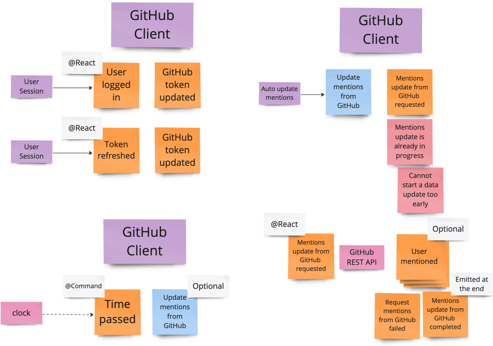
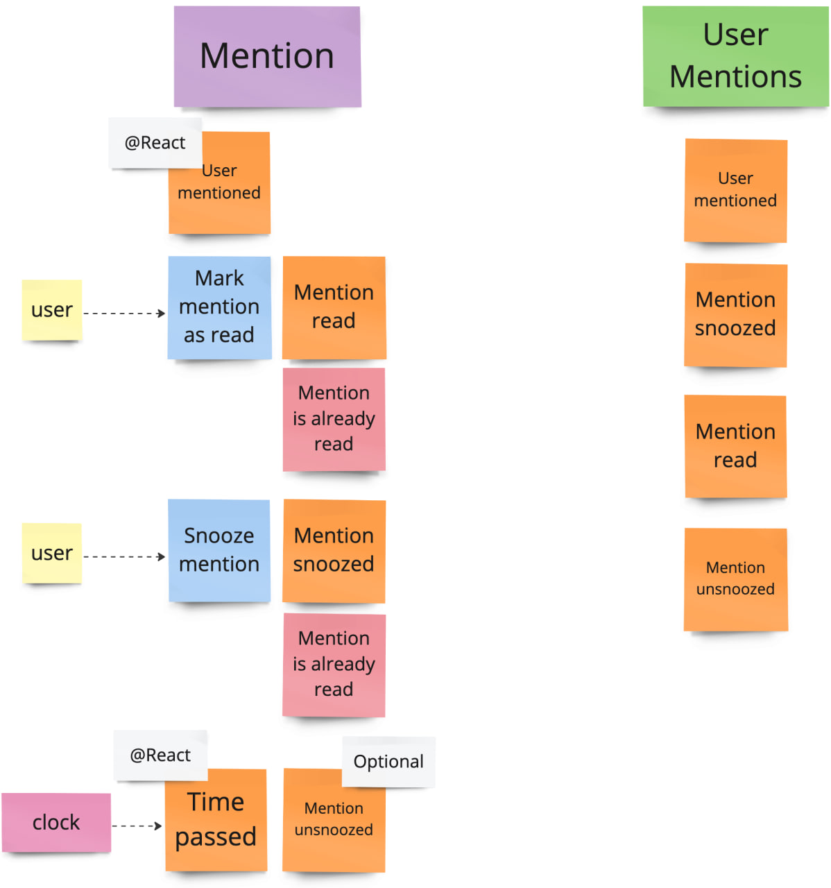

# Pingh

A [GitHub App](https://github.com/apps/pingh-tracker-of-github-mentions) that notifies users 
of new GitHub `@mention`s. It also runs as a system tray application on macOS.

Below is the list of implemented features of the application.

- Displays a list of recent `@mention`s for a logged-in GitHub user.
- Marks mentions as “read” or snooze them for later.
- Sends notifications for new mentions and for mentions whose snooze time has expired.
- Enters DND mode to turn off notifications.

## Service interaction scheme

This system comprises six services: Client, Server, GitHub REST API, 
and three Google Cloud Platform services — Scheduler, Datastore, and Secret Manager.
The Server is hosted on Google Cloud.

The following describes how these services interact:

- The Server uses Datastore for data storage.
- Secret Manager provides the Server with secure access to sensitive data, 
such as GitHub App secrets and authentication tokens.
- Scheduler sends HTTP requests to the Server every minute to inform it of the current time.
- The Server uses the GitHub REST API for authentication and retrieving the latest mentions 
of the logged-in user from GitHub.
- The Client and Server communicate via RPC.



## Event storming

The results of the Event storming session are present below.

The color of the sticks on the board represents the following:

- orange — an event;
- blue — a system command;
- warm red — a rejection;
- purple — a process manager;
- green — a projection;
- pink — an external system.


### Sessions bounded context



### Mentions bounded context





## Run locally

The application server can be run locally, and the client application distribution 
can also be built locally. The server requires JDK 11, while building the client requires JDK 17.

After downloading the project from GitHub, follow these steps:

1. Specify the GitHub App ID and secret in the configuration file. To do this, 
open the `local/config/server.properties` file in the `server` resources directory
and enter the GitHub App ID and secret as follows:

```properties
github-app.client.id=client_id
github-app.client.secret=client_secret
```

Replace `client_id` and `client_secret` with the values obtained from GitHub.

2. Start the Pingh server locally. The server always runs on port `50051`. 
To launch it, run the following command in the root project directory:

```shell
./gradlew publishToMavenLocal run
```

This will start the server on `localhost:50051` and publish the required JAR files 
for the client application to the Maven Local repository.

3. Configure the client's connection to the server. To do this, 
open the `config/server.properties` file in the client project resources directory 
and enter the server's address and port as follows:

```properties
server.address=localhost
server.port=50051
```

4. Build and run the client application. Navigate to the client project directory 
and execute the following command:

```shell
./gradlew runDistributable
```

This will generate a runnable distribution and start it automatically.

To create a distribution of the client application without launching it, 
use the following command:

```shell
./gradlew createDistributable
```

## Google Cloud deployment

The Pingh application is working in the cloud environment on the Google Cloud Platform.

To start the server in production mode on the cloud, 
the JVM argument named `GCP_PROJECT_ID` must be passed at server startup. 
This argument must specify the Google Cloud project ID.

### Compute Engine

The [Compute Engine](https://cloud.google.com/products/compute) offers the capability to create 
virtual machines. The Pingh server is deployed and running on the Compute Engine instance.

Hosting the application in Compute Engine also enables access 
to other Google Cloud services.

To allow external requests, 
a [firewall rule](https://cloud.google.com/firewall/docs/firewalls) must be configured, 
and ports `50051` (for the Pingh RPC server) and `8080` (for the HTTP server handling requests 
from the Google Cloud [Scheduler](#scheduler)) must be opened.

### Datastore

The Google Cloud [Datastore](https://cloud.google.com/products/datastore?hl) is used 
for data storage as a highly scalable NoSQL database.

To allow a server running on a Compute Engine instance to read from and write to Datastore, 
the server's service account must be granted the `Cloud Datastore User` role, 
and the `datastore` OAuth scope must be enabled.

Datastore requires initial configuration, including setting up indexes 
for Spine's internal record types. The configuration file can be found 
in the server's resources directory at `datastore/config/index.yaml`.
For more information, see the Google Cloud Platform 
[documentation](https://cloud.google.com/datastore/docs/tools/indexconfig).

### Scheduler

The Google Cloud [Scheduler](https://cloud.google.com/scheduler/docs/overview) allows 
to configure multiple scheduled tasks that deliver messages to specific targets.

For the Pingh application, a CRON task is set up to send a POST request with an empty body 
to the Pingh server every minute. This request includes an authentication token to ensure 
it will be accepted by the Pingh server.

### Secret Manager

The [Secret Manager](https://cloud.google.com/security/products/secret-manager) service 
is used to securely store and manage application secrets.

To allow a server running on a Compute Engine instance to access data from Secret Manager,
the server's service account must be granted the `Secret Manager Secret Accessor` role,
and the `cloud-platform` OAuth scope must be enabled.

The following secrets are configured for the Pingh app:

- `github_client_id`: The client ID of a GitHub App.
- `github_client_secret`: The client secret of a GitHub App.
- `auth_token`: The authentication token required for accessing the HTTP server running on the VM.

## Feedback

If you encounter any bugs or have suggestions for improving the application, 
please [contact us](https://github.com/spine-examples/Pingh/issues/new).
