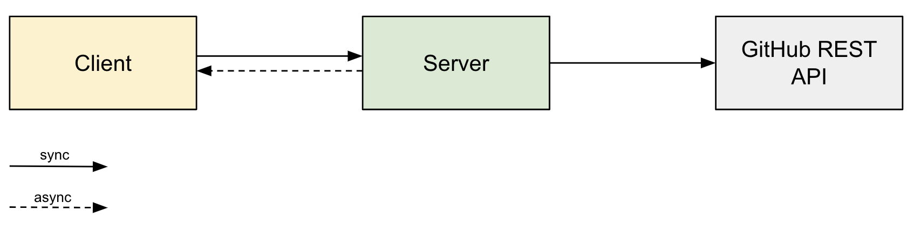

# Pingh

A [GitHub App](https://github.com/apps/pingh-tracker-of-github-mentions) that notifies users 
of new GitHub `@mention`s. It also runs as a system tray application on macOS.

- Displays a list of recent `@mention`s for a logged-in GitHub user.
- Marks mentions as “read” or snooze them for later.
- Sends notifications for new mentions and for mentions whose snooze time has expired.
- Enters DND mode to turn off notifications.

## Tech

The application consists of two parts: the server and the client, 
each utilizing different technologies.

The server uses:

- Spine Event Engine 1.9.0.
- Ktor 2.3.11. 
- Kotlin 1.9.20.
- JDK 11.
- Gradle 6.9.4.
- Google Cloud.
- Docker.

The client uses:

- Compose Multiplatform 1.6.11.
- Kotlin 1.9.20.
- JDK 17.
- Gradle 8.8.

## Project structure

The project consists of the following modules:

- `github` provides value objects to represent the GitHub context, 
  along with descriptions of the JSON responses returned by the GitHub REST API.
- `sessions` provides server-side code of the Sessions bounded context.
  This context includes user session management and the authentication process via GitHub.
- `mentions` provides server-side code of the Mentions bounded context.
  This context includes managing the status of mentions and 
  the process of retrieving new user mentions from GitHub.
- `clock` emulates an external system by sending the current time to the server.
- `server` configures the server environment, sets up the server, and starts it.
  This module also enables interaction with [Google Cloud](#google-cloud-deployment).
- `client` provides process states and flows for the client application.
- `desktop` provides the user interface created with Compose Multiplatform.

There are several auxiliary modules available for testing:

- `testutil-sessions` allows authentication to the app without using the GitHub REST API.
- `testutil-mentions` allows to retrieve new user mentions without using the GitHub REST API.

For a detailed analysis of the processes within domain contexts, 
see the [#EventStorming documentation](./EventStorming.md).

## Local run

The application server can be run locally, and the client application distribution 
can also be built locally.

The following should be considered when running the application locally:

- In-memory storage is used, so data will be lost between server restarts.
- The GitHub App ID and secret must be manually specified, meaning secrets are stored directly 
  in the project.
- A clock runs in a separate thread on the server to update the system with the current time.



To run the application locally, download the project from GitHub and follow these steps:

1. Specify the GitHub App ID and secret in the configuration file. To do this, 
  open the `local/config/server.properties` file in the `server` resources directory
  and enter the GitHub App ID and secret as follows:

```properties
github-app.client.id=client_id
github-app.client.secret=client_secret
```

Replace `client_id` and `client_secret` with the values obtained from GitHub.

2. Start the Pingh server locally. The server always runs on port `50051`. 
  To launch it, run the following command in the root project directory:

```shell
./gradlew publishToMavenLocal run
```

This will start the server on `localhost:50051` and publish the required JAR files 
for the client application to the Maven Local repository.

3. Configure the client's connection to the server. To do this, 
  open the `config/server.properties` file in the client project resources directory 
  and enter the server's address and port as follows:

```properties
server.address=localhost
server.port=50051
```

4. Build and run the client application. Navigate to the client project directory 
  and execute the following command:

```shell
./gradlew runDistributable
```

This will generate a runnable distribution and start it automatically.

To create a distribution of the client application without launching it, 
use the following command:

```shell
./gradlew createDistributable
```

## Google Cloud deployment

The Pingh application is working in the cloud environment on the Google Cloud Platform.


To start the server in production mode on the cloud, 
the JVM argument named `GCP_PROJECT_ID` must be passed at server startup. 
This argument must specify the Google Cloud project ID.

### Compute Engine

The [Compute Engine](https://cloud.google.com/products/compute) offers the capability to create 
virtual machines. The Pingh server is deployed and running on the Compute Engine instance.

Hosting the application in Compute Engine also enables access 
to other Google Cloud services.

To allow external requests, 
a [firewall rule](https://cloud.google.com/firewall/docs/firewalls) must be configured, 
and ports `50051` (for the Pingh RPC server) and `8080` (for the HTTP server handling requests 
from the Google Cloud [Scheduler](#scheduler)) must be opened.

### Datastore

The Google Cloud [Datastore](https://cloud.google.com/products/datastore?hl) is used 
for data storage as a highly scalable NoSQL database.

To allow a server running on a Compute Engine instance to read from and write to Datastore, 
the server's service account must be granted the `Cloud Datastore User` role, 
and the `datastore` OAuth scope must be enabled.

Datastore requires initial configuration, including setting up indexes 
for Spine's internal record types. The configuration file can be found 
in the server's resources directory at `datastore/config/index.yaml`.
For more information, see the Google Cloud Platform 
[documentation](https://cloud.google.com/datastore/docs/tools/indexconfig).

### Scheduler

The Google Cloud [Scheduler](https://cloud.google.com/scheduler/docs/overview) allows 
to configure multiple scheduled tasks that deliver messages to specific targets.

For the Pingh application, a CRON task is set up to send a POST request with an empty body 
to the Pingh server every minute. This request includes an authentication token to ensure 
it will be accepted by the Pingh server.

### Secret Manager

The [Secret Manager](https://cloud.google.com/security/products/secret-manager) service 
is used to securely store and manage application secrets.

To allow a server running on a Compute Engine instance to access data from Secret Manager,
the server's service account must be granted the `Secret Manager Secret Accessor` role,
and the `cloud-platform` OAuth scope must be enabled.

The following secrets are configured for the Pingh app:

- `github_client_id`: The client ID of a GitHub App.
- `github_client_secret`: The client secret of a GitHub App.
- `auth_token`: The authentication token required for accessing the HTTP server running on the VM.

## Feedback

If you encounter any bugs or have suggestions for improving the application, 
please [contact us](https://github.com/orgs/SpineEventEngine/discussions).
