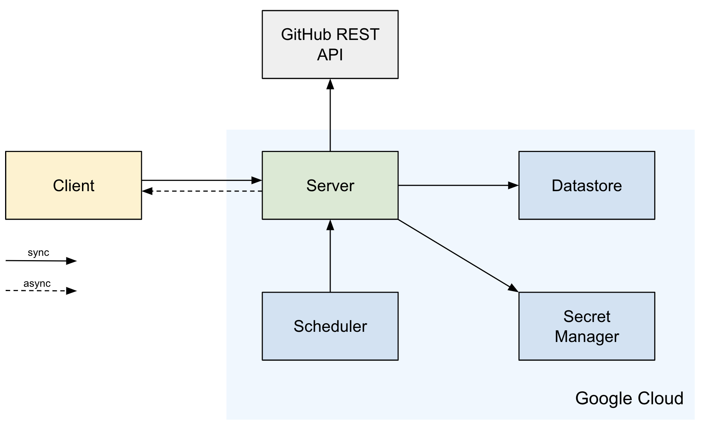

# Pingh

A [GitHub App](https://github.com/apps/pingh-tracker-of-github-mentions) that notifies users 
of new GitHub `@mention`s. It also runs as a system tray application on macOS.

- Displays a list of recent `@mention`s for a logged-in GitHub user.
- Marks mentions as “read” or snooze them for later.
- Notifies upon receiving new mentions or when the snooze time for a mention has expired.
- Supports Do Not Disturb mode.

## Tech

Server stack:

- Spine Event Engine 1.9.0.
- Kotlin 1.9.20.
- JDK 11.
- Ktor 2.3.11.
- Google Datastore.
- Docker.

Builds with Gradle 6.9.x. Deploys onto Google Cloud.

Client stack:

- Kotlin 1.9.20.
- Compose Multiplatform 1.6.11.
- JDK 17 or higher.

Builds with Gradle 8.10.x. Runs locally.

## Project structure

- `github` defines value objects to represent the GitHub context, 
  along with descriptions of the JSON responses returned by the GitHub REST API.
- `sessions` implements the Sessions bounded context, 
  which includes user session management and authentication via GitHub.
- `mentions` implements the Mentions bounded context,
  which includes managing mention statuses and 
  the process of retrieving new user mentions from GitHub.
- `clock` emulates an external system by sending the current time to the server.
- `server` configures the server environment, sets up the server, and starts it.
  This module also enables interaction with [Google Cloud](#google-cloud-deployment).
- `client` manages process states and flows for the client application.
- `desktop` provides the user interface created with Compose Multiplatform.

There are several auxiliary modules designed for testing of the corresponding Gradle subprojects: 
`testutil-sessions`, `testutil-mentions`, and `testutil-client`.

For a detailed analysis of the processes within domain contexts, 
refer to the [#EventStorming documentation](./EventStorming.md).

## Local run

Both client and server can be built and launched locally.

When running the application locally, consider the following:

- In-memory storage is used, so data will be lost between server restarts.
- Both GitHub App ID and GitHub App secret must be specified explicitly 
  by editing [server.properties](./server/src/main/resources/local/config/server.properties) file.


### Prerequisites

- JDK 11 and JDK 17 or higher.
- Docker Desktop.

### Build

To run the application locally, download the project from GitHub and follow these steps:

1. Specify the GitHub App ID and secret in the configuration file. To do this, 
  open the `local/config/server.properties` file in the `server` resources directory
  and enter the GitHub App ID and secret as follows:

```properties
github-app.client.id=client_id
github-app.client.secret=client_secret
```

Replace `client_id` and `client_secret` with the values obtained from GitHub.

2. Start the Pingh server locally. The server always runs on port `50051`. 
  To launch it, run the following command in the root project directory:

```shell
./gradlew publishToMavenLocal run
```

This will start the server on `localhost:50051` and publish the required JAR files 
for the client application to the Maven Local repository.

3. Configure the client's connection to the server. To do this, 
  open the `config/server.properties` file in the client project resources directory 
  and enter the server's address and port as follows:

```properties
server.address=localhost
server.port=50051
```

4. Build and run the client application. Navigate to the client project directory 
  and execute the following command:

```shell
./gradlew runDistributable
```

This will generate a runnable distribution and start it automatically.

To create a distribution of the client application without launching it, 
use the following command:

```shell
./gradlew createDistributable
```

## Google Cloud deployment

The Pingh application runs in the cloud environment on the Google Cloud Platform.



To start the server in production mode on the cloud, 
the JVM argument named `GCP_PROJECT_ID` must be passed at server startup. 
This argument must specify the Google Cloud project ID.

### Compute Engine

The [Compute Engine](https://cloud.google.com/products/compute) offers the capability to create 
virtual machines. The Pingh server is deployed and running on a Compute Engine instance.

Hosting the application in Compute Engine also enables access 
to other Google Cloud services.

To allow external requests, 
a [firewall rule](https://cloud.google.com/firewall/docs/firewalls) must be configured, 
and ports `50051` (for the Pingh RPC server) and `8080` (for the HTTP server handling requests 
from the Google Cloud [Scheduler](#scheduler)) must be open.

### Datastore

The Google Cloud [Datastore](https://cloud.google.com/products/datastore?hl) is used 
for data storage as a highly scalable NoSQL database.

To allow a server running on a Compute Engine instance to read from and write to Datastore, 
the server's service account must be granted the `Cloud Datastore User` role, 
and the `datastore` OAuth scope must be enabled.

Datastore requires initial configuration, including setting up indexes 
for Spine's internal record types. The configuration file can be found 
in the server's resources directory at `datastore/config/index.yaml`.
For more information, see the Google Cloud Platform 
[documentation](https://cloud.google.com/datastore/docs/tools/indexconfig).

### Scheduler

The Google Cloud [Scheduler](https://cloud.google.com/scheduler/docs/overview) allows for
configuring multiple scheduled tasks that deliver messages to specific targets.

For the Pingh application, a `cron` task is set up to send a POST request with an empty body 
to the Pingh server every minute. This request includes an authentication token to ensure 
it will be accepted by the Pingh server.

### Secret Manager

The [Secret Manager](https://cloud.google.com/security/products/secret-manager) service 
is used to securely store and manage application secrets.

To allow a server running on a Compute Engine instance to access data from Secret Manager,
the server's service account must be granted the `Secret Manager Secret Accessor` role,
and the `cloud-platform` OAuth scope must be enabled.

The following secrets are configured for the Pingh app:

- `github_client_id`: The client ID of a GitHub App.
- `github_client_secret`: The client secret of a GitHub App.
- `auth_token`: The authentication token required for accessing the HTTP server running on the VM.

## Feedback

We accept the questions and suggestions via the corresponding 
[GitHub Discussions section](https://github.com/orgs/SpineEventEngine/discussions).
